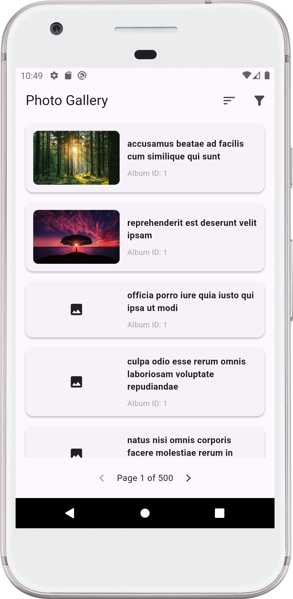
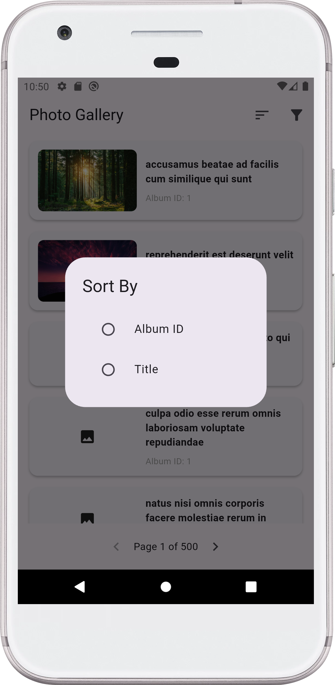
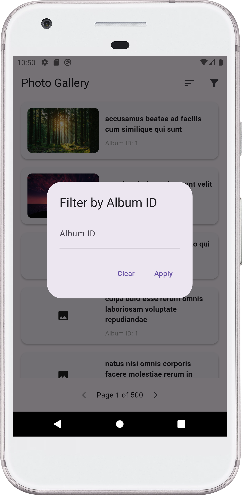

# 📸 Photo Gallery App - Flutter Challenge

A high-performance Flutter application that displays list of data with efficient JSON parsing, pagination, sorting, and filtering capabilities.

## 🌟 Key Features

### 🚀 Core Functionality

- **Large JSON Processing**: Background isolates for smooth parsing
- **Pagination**: 10 items per page with navigation controls
- **Sorting**: By album ID or photo title
- **Filtering**: By specific album ID
- **Image Caching**: Optimized thumbnail loading

### ⚙️ Technical Highlights

- **Isolate-based JSON parsing** prevents UI freezing
- **Riverpod state management** for clean architecture
- **Responsive UI** with Material Design 3
- **Type-safe models** with proper error handling

## 📁 Project Structure

- lib/
- ├── data/
- │ └── models/
- │ │ └── photo.dart # Photo data model
- ├── domain/
- │ └── providers/
- │ │ ├── photo_provider.dart # Photo data state
- │ │ ├── ui_provider.dart # UI state management
- │ │ └── providers.dart # Provider exports
- ├── ui/
- │ ├── pages/
- │ │ └── home_page.dart # Main screen
- │ └── widgets/
- │ │ ├── filter_dialog.dart # Album filter UI
- │ │ ├── photo_item.dart # Single photo card
- │ │ ├── photo_list.dart # Scrollable list
- │ │ └── sort_dialog.dart # Sorting options
- ├── utils/
- │ └── services/
- │ │ └── json_parser.dart # JSON parsing service
- └── main.dart # App entry point

## 🛠️ Tech Stack

| Component        | Technology           |
|------------------|----------------------|
| Framework        | Flutter 3.32.0       |
| Language         | Dart 3.8.0           |
| Image Loading    | cached_network_image |
| State Management | Riverpod             |
| JSON Parsing     | Dart Isolates        |

## 📱 App Screenshots

  
   
  

